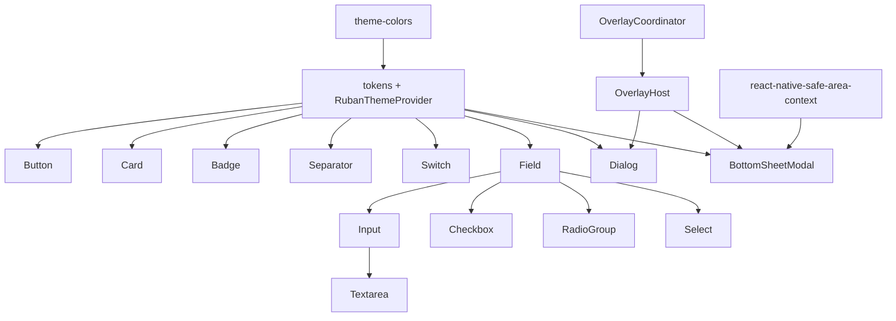

# Ruban UI Package Boundaries

Ruban UI uses a hybrid split: one package per independently evolving leaf component, with a
small number of shared foundation packages and one intentionally grouped form package. Neither a
single category package nor a blanket package-per-file rule reflects the current dependency graph.

Run the source graph check with:

```bash
pnpm design:ui-graph:check
```

The analyzer treats the native registry as canonical when the same component also exists in the
latest Gongshu app. App-only primitives and the latest design token source complete the graph.

## Observed graph



The graph has no cycles. Its meaningful coupling points are:

- Theme context and semantic tokens are consumed by every visual component.
- OverlayHost and OverlayCoordinator form one compatibility boundary around React Native Modal.
- Dialog and BottomSheetModal share that overlay boundary but have independent public behavior.
- Input, Checkbox, RadioGroup, and Select consume Field state; Textarea is an Input specialization.
- BottomSheetModal and the icon set keep native peers explicit instead of bundling duplicate native
  modules into consumers.

## Target packages

All scoped names retain `react-native-` so their platform contract remains explicit.

| Package | Owns | Package relations | Additional native peer |
| --- | --- | --- | --- |
| `@ruban-labs/react-native-ui-theme` | colors, semantic roles, spacing, radius, provider and hooks | none | none |
| `@ruban-labs/react-native-ui-overlay` | coordinator, single native Modal host, queue/stack/replace policy | none | none |
| `@ruban-labs/react-native-ui-dialog` | dialog root, trigger, close, content and animation | theme + overlay peers | none |
| `@ruban-labs/react-native-ui-sheet` | bottom sheet and selection sheet | theme + overlay peers | `react-native-safe-area-context` |
| `@ruban-labs/react-native-ui-form` | Field, Input, Textarea, Checkbox, RadioGroup and Select | theme peer | none |
| `@ruban-labs/react-native-ui-icons` | theme-aware SVG icon set | none | `react-native-svg` |
| `@ruban-labs/react-native-ui-button` | Button | theme peer | none |
| `@ruban-labs/react-native-ui-card` | Card composition | theme peer | none |
| `@ruban-labs/react-native-ui-badge` | Badge | theme peer | none |
| `@ruban-labs/react-native-ui-separator` | Separator | theme peer | none |
| `@ruban-labs/react-native-ui-switch` | Switch | theme peer | none |

The form package exports stable subpaths such as `./field`, `./input`, `./textarea`, `./checkbox`,
`./radio-group`, and `./select`. Splitting those files into six packages now would turn one shared
state contract into six synchronized releases without removing a native or optional dependency.

Theme and overlay must be peer dependencies of their consumers, with matching development
dependencies in the monorepo. Both expose React contexts; allowing duplicate installed copies can
disconnect a component from the provider used by the application.

`@ruban-labs/react-native-progress` and `@ruban-labs/react-native-collapsible` remain independent.
They are focused behavior libraries and must not acquire a Ruban UI theme dependency.

## Release order

First publish the boundaries that prove the architecture:

1. `react-native-ui-theme`
2. `react-native-ui-overlay`
3. `react-native-ui-dialog`
4. `react-native-ui-sheet`
5. `react-native-ui-form`
6. `react-native-ui-icons`

Publish the five leaf visual primitives after their public props and accessibility contracts stop
changing in the Gongshu workbench. A future `@ruban-labs/react-native-ui` package may re-export
stable packages for convenience, but it contains no implementation or native code and is not part
of the first release.

## Split rules

A component receives its own package when at least one of these is true:

1. It has an independent public contract and release cadence.
2. It introduces an optional native peer or platform configuration.
3. Consumers commonly need it without the rest of its visual category.
4. Isolating it removes a meaningful dependency from other consumers.

Components stay together when they share state/context internals, are implementation
specializations of each other, and would otherwise require lockstep versions. Package boundaries
follow runtime and release coupling, not the number of source files.

## Compatibility gate

Every package keeps the React Native floor at 0.66 and uses the existing source/CommonJS/module/
types export shape. JavaScript-only UI packages have four valid architecture cells:

| React Native era | Old architecture | New architecture |
| --- | --- | --- |
| 0.66 | required | unavailable |
| 0.77 | required | required |
| latest | unavailable | required |

Before publication, each package must pass unit and accessibility tests, packed-tarball type-check
and Metro bundle fixtures in all three eras, native Release/Hermes compilation in all four cells,
and deterministic deep-link runtime flows on each platform. A package with an optional native peer
also needs a consumer fixture proving that peer is declared rather than accidentally bundled.

Showcase screens, navigation, deep-link parsing, build metadata, and Gongshu-only controls are test
consumers. They never become runtime dependencies of a UI package.
